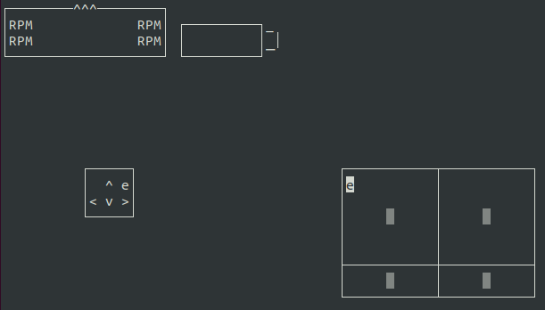

# iotbot-TUI
A control TUI with joystick support for iotbot robots  
https://github.com/EduArt-Robotik/iotbot  

The TUI with no data.  

 

---

 

To compile this program you will need the library `ncurses`
 > sudo apt install libncurses-dev

 

## Happy driving!